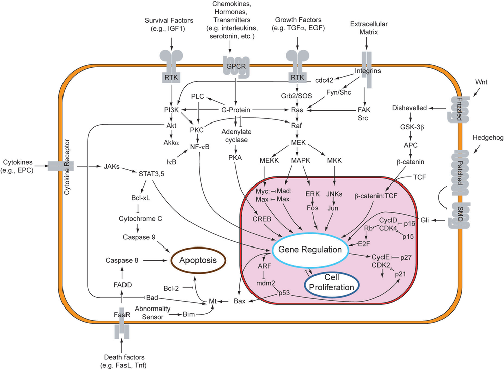

---
output:
  xaringan::moon_reader:
    css: ["xaringan-themer.css"]
    self_contained: true
    nature:
      highlightStyle: style_mono_light(base_color = "#23395b")
      highlightLines: true
      countIncrementalSlides: false
---
 

	  
<style>
 
/* .remark-slide-content { */
/*   padding-top: 20px; */
/*   padding-left: 20px; */
/*   padding-right: 20px; */
/*   padding-bottom: 20px; */
/* } */
.remark-slide-content > h1:first-of-type {
  margin-top: 0px;
  margin-bottom: 0px;
}
.remark-slide-content > h2:first-of-type {
  margin-top: 0px;
  margin-bottom: 0px;
}

a:link {
    color:  #1f618d;
}

a:visited {
    color:  #1f618d;
}


.small { font-size: 70% }

<!-- .remark-slide-content{ background-color: #fff8dc} <\!-- cornsilk -\-> -->

</style>

```{r xaringan-tile-view, echo=FALSE}
xaringanExtra::use_tile_view()
```


```{r,include=FALSE}
source('~/papers/talks/sje-xaringan.R')
redacted = ! (Sys.getenv("REDACTED")=='FALSE')
```

```{r xaringan-themer, include=FALSE, warning=FALSE}
library(xaringanthemer)
library(xaringanExtra)
##style_solarized_light()
style_mono_light(base_color = "#23395b")
xaringanExtra::use_scribble(pen_color="#008b8b")
```

## N7: Computational approaches

```{css echo=FALSE}
.highlight-last-item > ul > li, 
.highlight-last-item > ol > li {
  opacity: 0.5;
}
.highlight-last-item > ul > li:last-of-type,
.highlight-last-item > ol > li:last-of-type {
  opacity: 1;
}
```


<br>

```
Stephen J Eglen                  DAMTP (Applied Maths/Theoretical Physics)
https://sje30.github.io          University of Cambridge
sje30@cam.ac.uk
```


HTML Slides: <https://sje30.github.io/n7> (CC BY 4.0 license)
<br>


---
# Part one: introduction

---
## Why model?

  * Everyone models.
  
  * Model system (zebrafish / mouse / organoids).
  
  * I just happen to use the language of maths/computers rather than
    verbal arguments.


<!-- TODO: picture of a gene signalling pathway? -->
<!--  -->

<!-- https://en.wikipedia.org/wiki/Cell_signaling -->

`r im1("images/1000px-Signal_transduction_pathways.png", width=500)`
`r pbr("https://en.wikipedia.org/wiki/Cell_signaling")`

---
## What can we do with modelling


* Quantitative modelling: test that theories hold true, or test their
  limits.

* Qualitative modelling: make abstract models to capture essence of a
  system.  (cf. epidemiological modelling since 2020).

* Experiments test for *necessity*; models test for *sufficiency*.
  
* Make predictions  about novel situations.

* Made postdictions to explain past data sets (Abbott 2008).


---
# Part two: Physiological models

We start with classic Hodgkin and Huxley (1952) model.


---
## Mathematical description of ion channels

Voltage-gated channels: gating variables [0,1] to represent flow of ions.

For given voltage, e.g. K channel activation, gated by $n$:


(1-n) Gates switch from closed state to open state with rate $\alpha$.

(n) Gates switch from open state to closed state with rate $\beta$.

i.e. 
	$$ \frac{dn}{dt} = \alpha(1-n) - \beta n $$

The terms $\alpha$ and $\beta$ themselves depend on membrane voltage


Similar expressions can be created for sodium activiation (m) and
inactivation (h).

---
## Ionic flow determines membrane voltage.


We can derive an expression:

$$c_m \frac{dV}{dt} = -g_L (E_L - V) - g_{Na} m^3 h (E_{Na} - V) - g_K n^4(E_K - V) + I_e$$
	
where the $g$ terms are the maximal conductances for each channel, and
the $E$ terms are the resting potentials for each channel.

This leads to four coupled differential equations.  

Solving these requires methods of *numerical integration*.

---
## Demonstration


Live demo of all-or-nothing behaviour: 

<https://demonstrations.wolfram.com/HodgkinHuxleyActionPotentialModel/>

As you vary external stimulus you can see emergence of an action
potential.

 
---
## Dynamics of channels and membrane voltage

`r im1("ch5fig11.png", 350)`
`r pbr("Dayan and Abbott (2002) fig 5.11.")`


---
## Goodness of fit

Hodgkin and Huxley(1952).  Reproduced from David Sterratt.  Upper
trace: model; numbers give initial depolarisations (in mV);
recordings at 6~C.


Data taken from squid giant axon; much wider axonal diameter (800
um) than normal (2 um) for rapid signal propagation [escape behaviour].

`r im1("sterratt_fig3_9.png", 500)`


---
## Simplifications to H-H framework

  Two observations (Rinzel, 1985):
  
  `r im1("ch5fig10.png", 500)`
  `r pbr("Dayan and Abbott (2002) fig 5.10.")`
  
1. $m$ reaches steady-state almost instantaneously.
  
2. $h$ and $1-n$ have similar voltage dependence, so model just one of
   them.

---
## Rinzel simplification vs HH model

Wilson (1999) Fig 9.3.  Comparison of HH model with Rinzel
approximation (eqn 9.7).  Both systems produce a reduced spike
amplitude at higher frequencies.

`r im1("wilson_ch9fig3.png", 400)`

---
## What is the 'right model' to use?

  Various simplifications to Hodgkin-Huxley (Izhikevich, 2004; Figure 2):

`r im1("izh2004-fig2.png", 600)`

---
## What is the Izhikevich (2003) model?


`r im1("izhik.png", 800)`

---
## Application of Izhikevich model neurons 

We can now build model circuits using these neurons.  e.g. Tomkova et
al 2015: <https://paperpile.com/app/p/5529195b-9246-0d04-8449-09b3cc7289db>


---
## Dynamic clamp

  Dynamic clamp takes membrane voltage, and simulates current that
  will pass through a particular channel; that channel is injected
  real-time, as if that channel existed on the neuron.

  This allows us to use biology to worry about all the other
  conductances, rather than a modeller using poor estimates of the
  conductances.


---
## Dynamic clamp application 


  Can two mutually inhibitory neurons fire in synchrony?
  
  Use dynamic clamp to *virtually* connect two neurons.

`r pbr("Marder and Abbott 1995, Fig 2")`

`r im1("marder1995_fig2.png", 800)`


---
# Part three: Anatomical models

---
## Retinal mosaics: $\alpha$ retinal ganglion cells

`r im1("wassle1981c_fig1a.png", 750)`


$1.7 \times 1.2$ mm staining of cat retina  (Wässle et al., 1981).

---
## Minimal distance (``dmin'') serial model

`r im1("dmin_movie_f-6.svg", 750)`
